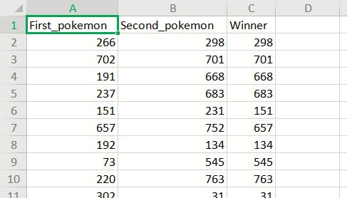

# Title of your final project

### Groups
* 林冠宇, 108352028
* 黃子瑋, 108352024
* 蔡政融, student ID3

### Goal
Our goal is to predict the result of the Pokémon battle !

### Demo 
You should provide an example commend to reproduce your result
```R
Rscript code/your_script.R --input data/training --output results/performance.tsv
```
* any on-line visualization


## Folder organization and its related information

### docs
* Your presentation, 1072_datascience_FP_<yourID|groupName>.ppt/pptx/pdf, by **Jun. 25**
* Any related document for the final project
  * papers
  * software user guide

### data

* Data we use is the dataset is the dataset on the kaggle website called "Pokemon- Weedle's Cave"

  [Pokemon Battle](https://www.kaggle.com/terminus7/pokemon-challenge)
  


* Input format

  The dataset contains twelve variables:
  
  Variable |  Definition | Key
  ---------|-------------|----------
  Number   |Code name of Pokemon| 1 to 800
  Name     |Name of Pokemon|
  Type 1   |1st attack type|
  Type 2   |2nd attack type|
  HP       |Hitpoints|
  Attack   |Attack force|
  Defense  |Defense points|
  Sp.Atk   |Special attack force|
  SP.Def   |Special defense points|
  Speed    |Speed of pokemon|
  Generation|Development stage| 1 to 6
  Legendary|Legendary status|1=legendary, 0=ordinary
  
  


  And the data below is the result of the battle, we will divide the data into train and test to train the model
  
  
  
  Note : The Pokemon in the first columns attacks first.

* Any preprocessing?
  * Handle missing data
  * Scale value

### code

* Which method do you use?
* What is a null model for comparison?
* How do your perform evaluation? ie. Cross-validation, or extra separated data

### results

* Which metric do you use 
  * precision, recall, R-square
* Is your improvement significant?
* What is the challenge part of your project?

## Reference
* Code/implementation which you include/reference (__You should indicate in your presentation if you use code for others. Otherwise, cheating will result in 0 score for final project.__)
* Packages you use
* Related publications


